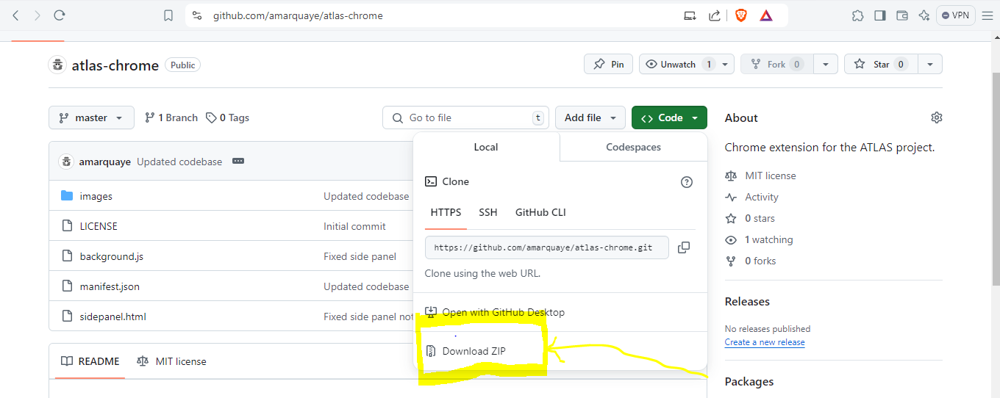
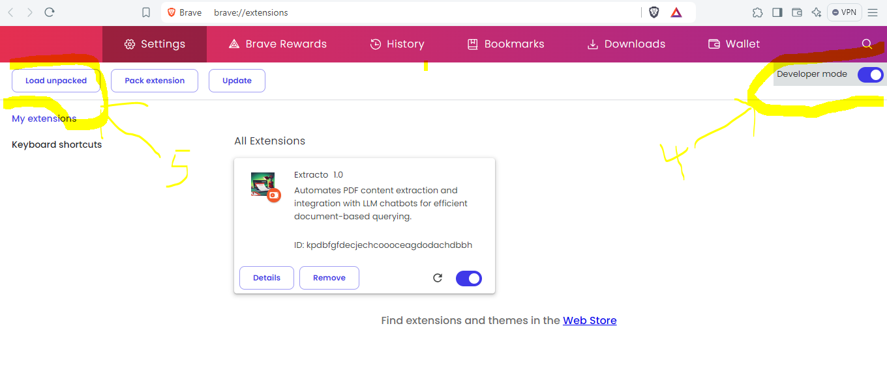
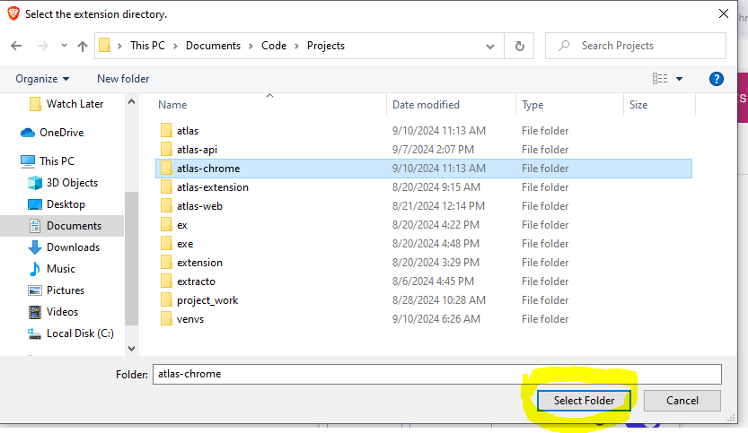
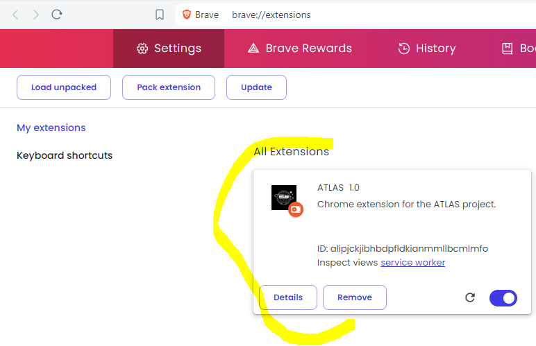
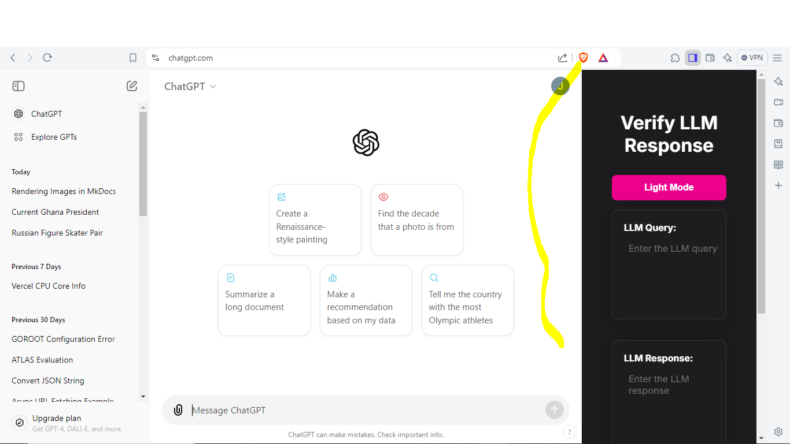

# ATLAS Chrome Extension

## Overview

The Atlas Chrome Extension is a powerful tool designed to enhance your interaction with Large Language Models (LLMs) by providing real-time factual verification. This extension seamlessly integrates with popular AI platforms, offering a convenient side panel for detecting and mitigating potential hallucinations in LLM responses.

## Features

- Automatic activation on supported AI platforms
- Easy-to-use side panel interface
- Web-based verification of LLM responses
- Keyboard shortcut for quick access

## Supported Platforms

The extension activates automatically when you visit any of the following websites:

- [ChatGPT](https://chatgpt.com)
- [Google Gemini](https://gemini.google.com)
- [Anthropic Claude](https://claude.ai)

!!! note
    Even though we have specified websites for it to work on, our extension would also work on any website as long as you can copy and paste the text.

## Installation

- Visit [https://github.com/amarquaye/atlas-chrome](https://github.com/amarquaye/atlas-chrome "Download extension") and
  download the zip file as shown below.

    

- Extract the files into a folder of your choice.

- Open your browser(chromium based) and type `chrome://extensions` in my case i have to type `brave://extensions`
in the address bar since i'm using brave; another chromium-based browser.

- Click on developer mode to toggle developer mode and unpack extension.

- Click on load unpacked as shown in the diagram below.

    

- Select the folder which you extracted the files into and click on **Select Folder** in the dialogue box.

    

- Congrats, the installation is successful upon seeing this image as shown below.

    

## Usage

1. **Activating the Side Panel**
   - Use the keyboard shortcut: `Ctrl + Shift + H`
   - Or click the extension icon in the browser toolbar

2. **Verifying LLM Responses**
   a. Copy your original query to the LLM
   b. Paste it into the "LLM Query" textarea in the side panel
   c. Copy the LLM's response
   d. Paste it into the "LLM Response" textarea
   e. Click the "Verify" button

3. **Reviewing Results**
   The extension will search the web to verify the factuality of the LLM's response and present its findings directly in the side panel.

## User Interface

The side panel features a clean, intuitive interface with clearly labeled sections:

- LLM Query input area
- LLM Response input area
- Verify button
- Results display section

This streamlined design ensures a smooth and efficient verification process, allowing users to quickly assess the accuracy of AI-generated content.

   

## Benefits

- Enhance the reliability of AI interactions
- Quickly identify potential misinformation or hallucinations
- Seamless integration with your existing AI workflow
- Improve decision-making based on AI-assisted information

## Technical Details

To view and test the api, visit [https://atlasproject-phi.vercel.app/docs](https://atlasproject-phi.vercel.app/docs) to
access the interactive documentation and view the [technical documentation here](https://amarquaye.github.io/atlas/).

## License

All the tools under the ATLAS suite are licensed under the [MIT License](https://github.com/amarquaye/atlas-chrome/blob/master/LICENSE "View LICENSE").
